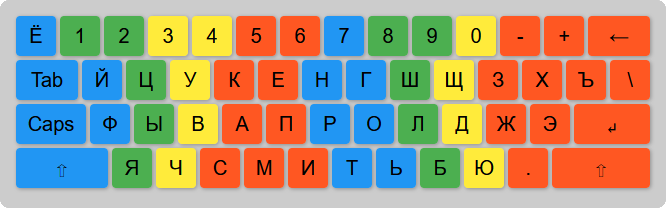

# Клава

Клавиатурный тренажёр.

Лучший способ научиться слепой печати - запретите себе нажимать клавиши неправильными пальцами.
И не так уж важно, смотрите ли вы на клавиатуру или нет. Мышечная память в итоге выработается.

Важно, чтобы пальцы не лежали на клавишах. Кисти рук должны нависать над клавиатурой и свободно перемещаться.

Нестандартная, но более удобная постановка пальцев:

