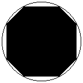

# Spacewar!

## Оригинал

Spacewar! - одна из первых компьютерных игр ([wiki](https://ru.wikipedia.org/wiki/Spacewar!)).
Была разработата в 1962 году для компьютера PDP-1.<br>
Как она выглядела: <https://youtu.be/1EWQYAfuMYw?t=799>.<br>
Поиграть на эмуляторе онлайн: <https://www.masswerk.at/spacewar/>.<br>
Исходники на ассемблере: <https://www.masswerk.at/spacewar/sources/>.<br>
Разбор исходников: <https://www.masswerk.at/spacewar/inside/>.

### Обнаружение столкновений объектов

Описано [здесь](https://www.masswerk.at/spacewar/inside/insidespacewar-pt3-objects.html).

На каждой итерации игрового цикла:

```
radius = 6000; // Радиус столкновений
half_radius = radius / 2; // Половина радиуса

// Для каждой пары объектов
for (obj1_index = 0; obj1_index < num_objects; ++obj1_index)
{
    // Уже проверенные пары не будут проверяться заново
    for (obj2_index = obj1_index; obj2_index < num_objects; ++obj2_index)
    {
        dist_x = abs(x1 - x2); // Расстояние по оси X
        if (dist_x >= radius)
            continue;

        dist_y = abs(y1 - y2); // Расстояние по оси Y
        if (dist_y >= radius)
            continue;

        dist = dist_x + dist_y; // Манхэттенское расстояние рассчитать быстрее, чем евклидово расстояние
        if (dist >= radius + half_radius)
            continue;

        explode(); // Взрыв
    }
}
```

По сути, при обнаружении столкновений считается, что у объектов коллайдеры - неправильные восьмиугольники (квадраты с обрезанными углами).



### Поведение торпед

Описано [здесь](https://www.masswerk.at/spacewar/inside/insidespacewar-pt7-shootout.html).

Торпеды появляются на некотором расстоянии перед кораблём и к их скорости добавляется скорость корабля.
Это сделано для того, чтобы корабль не взрывался от собственных торпед.

### Порты

[Тут](https://saildart.org/SW.P11[11,BO]) исходники порта на PDB-11, созданного Botond G. Eross в 1973 году.
Много комментариев.

[Тут](https://github.com/MattisLind/SPACEWAR) исходники ещё одного порта на PDP-11, созданного Bill Seiler и Larry Bryant в 1974 году.
Много комментариев.

## Современная версия

Вариация этой игры от Valve есть бесплатно в Стиме. Устанавливается командой `steam://install/480`
([источник](https://www.youtube.com/watch?v=zU3dCu_lSu8)).<br>
Исходники есть в [Steamworks SDK](https://partner.steamgames.com/doc/sdk/api/example).
Можно глянуть, например, [тут](https://github.com/rlabrecque/SteamworksSDK/tree/main/SteamworksExample).<br>
Эту игру часто [используют пираты](https://dtf.ru/flood/6673-spacewar-igra-s-pomoshyu-kotoroi-piraty-obhodyat-zashitu-steam) для запуска мультиплеерных игр.

### Обнаружение столкновений объектов

Смотрите функцию `bool CVectorEntity::BCollidesWith(CVectorEntity* pTarget)`
в файле [VectorEntity.cpp](https://github.com/rlabrecque/SteamworksSDK/blob/main/SteamworksExample/VectorEntity.cpp).

У каждого объекта коллайдер - круг с заданным радиусом.

Для обнаружения пересечений кругов вычисляется евклидово расстояние между центрами кругов и сравнивается с суммой их радиусов.
